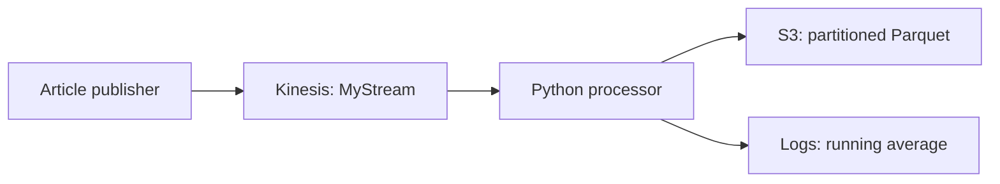

# Objective
Develop a data processing pipeline that tranforms a large volume of text data from a Kinesis stream into a format suitable for the continuous training a text summarization model. 

# Overview
The NLP model must be trained on a regular schedule to keep up-to-date on the stylistic elements of modern journalism. Therefore I developed a data pipeline capable of processing incoming text data efficiently. The ultimate goal is to enhance this data in ways that bolster machine learning (ML) training scenarios. This includes considering how the result is stored, ensuring that it supports efficient data access patterns suitable for large-scale processing and ML model training.

# Kinesis article enrichment pipeline

This project reads article events from Kinesis, adds a `word_count` feature, keeps a running average of that feature, and writes the enriched records to S3 as partitioned Parquet files. Everything runs locally with Docker Compose and LocalStack.

## Run it

Prerequisites: Docker with the Compose plugin and `make`.

```bash
make demo
```

`make demo` builds the images, starts LocalStack, publishes about 1 MiB of sample articles, runs the processor, and waits for the verifier to find and validate the output. A successful run ends with output similar to:

```text
Verification passed: 1100 enriched rows across 5 Parquet files; average word count=582.41
```

The exact row count and average vary because the publisher uses Faker.

Useful commands:

```bash
make test       # run the unit tests in the processor image
make verify     # validate the Parquet currently in S3
make logs       # show publisher and processor logs
make down       # stop containers and keep the local demo state
make clean      # remove containers, output, and checkpoint state
```

To inspect the output directly:

```bash
docker compose exec localstack \
  awslocal s3 ls s3://my-bucket/enriched_articles/ --recursive
```

The cumulative average is intentionally not written to S3. It is reported after every committed batch and again during graceful shutdown:

```bash
docker compose logs processor | grep average_word_count
```

## Data flow



The processor uses micro-batches. It flushes after 250 valid records or five seconds, whichever happens first.

Each output row contains the original article fields plus:

| Field | Purpose |
| --- | --- |
| `word_count` | Whitespace-delimited word count used as the requested feature |
| `ingested_at` | UTC processing timestamp |
| `source_stream` | Source Kinesis stream |
| `source_shard` | Source shard for traceability |
| `source_sequence_number` | Source sequence number for replay checks and downstream deduplication |

Files are stored using Hive-style partitions:

```text
s3://my-bucket/enriched_articles/
  ingestion_date=2026-08-25/
    ingestion_hour=20/
      batch-3b1a0d6a618cc05a.parquet
```

## Design decisions

### Python and boto3

I used a small Python consumer rather than adding Spark or Flink to the local environment. The sample has one shard and a few thousand records, so a distributed runtime would make the exercise slower to run without improving the result. The code still uses the same boundaries I would keep in a larger implementation: source consumption, validation/enrichment, batch writing, and checkpointing are separate concerns.

For production scale, I would run this logic as a managed Flink application or use Kinesis Data Streams with Firehose transformation, depending on latency and transformation needs. Checkpoints would move to Flink-managed state or DynamoDB, metrics would go to CloudWatch, and malformed records would go to a dedicated dead-letter prefix.

### Parquet with Snappy compression

Parquet is a better training input than one JSON object per event. It reduces S3 request volume, supports column pruning, has an explicit schema, and can be read efficiently by Spark, PyArrow, pandas, and common ML training frameworks. Snappy gives fast decompression without a large CPU cost.

Partitioning by ingestion date and hour lets a training job load a time window without listing or scanning the full dataset. I used ingestion time instead of `publish_date` because source dates can be late, missing, or malformed.

### Average calculation

The average is maintained incrementally as `total_word_count / valid_record_count`. That uses constant memory and works for an unbounded stream. Per the requirement, the value is logged but not stored. It covers all valid records processed by the current processor run; it resets when that process restarts.

### Delivery and recovery

The processor commits a shard checkpoint only after its batch has been uploaded to S3. Checkpoints are written atomically to a Docker volume and are used to resume with `AFTER_SEQUENCE_NUMBER`.

Kinesis consumption is therefore **at least once** around a crash between the S3 upload and checkpoint commit. Output filenames are deterministic for the sequence numbers in a batch, which makes the common replay overwrite the same object. Source shard and sequence number are also included in every row so a downstream job can enforce deduplication. I would use transactional sink/checkpoint support in a production Flink version if strict exactly-once output were required.

Malformed JSON, missing identifiers, and non-string content are logged and skipped. Their sequence number is checkpointed during the next successful flush so one bad event does not block the shard. If an S3 write fails, the checkpoint is not advanced and the container exits for a clean replay.

## Configuration

All runtime settings are environment variables in `docker-compose.yml`.

| Variable | Default | Meaning |
| --- | --- | --- |
| `STREAM_NAME` | `MyStream` | Kinesis stream to read |
| `OUTPUT_BUCKET` | `my-bucket` | S3 destination bucket |
| `OUTPUT_PREFIX` | `enriched_articles` | S3 key prefix |
| `BATCH_SIZE` | `250` | Valid records per batch |
| `FLUSH_INTERVAL_SECONDS` | `5` | Maximum time before flushing a partial batch |
| `POLL_INTERVAL_SECONDS` | `0.5` | Delay after an empty poll |
| `STARTING_POSITION` | `TRIM_HORIZON` | Initial read position when no checkpoint exists |
| `CHECKPOINT_PATH` | `/state/checkpoints.json` | Local durable checkpoint file |
| `MAX_RECORDS_PER_READ` | `500` | Maximum records requested per shard poll |

To simulate ongoing traffic, increase `NUM_ITERATIONS` and set `PUBLISH_INTERVAL_SECONDS` on the publisher service.

## Tests and verification

The unit suite covers:

- word counting and record enrichment;
- invalid input handling;
- incremental average calculation;
- atomic checkpoint read/write behavior;
- Parquet schema, partitioning, and deterministic object names.

The end-to-end verifier polls S3, reads every Parquet file, recalculates each row's word count, checks the required schema, rejects duplicate shard/sequence pairs, and prints the overall average.

## Assumptions

- A word is a non-empty token separated by whitespace. This rule is simple, deterministic, and sufficient for the generated English text.
- `article_id` and `content` are required. Other source fields may be null.
- The local exercise starts with one shard. The consumer can read multiple existing shards, but it does not discover shards added after startup.
- The publisher owns creation of `MyStream` and `my-bucket`, matching the starter project.
- The Docker checkpoint volume is appropriate for the local demo; it is not presented as a production state store.

## Project layout

```text
.
├── docker-compose.yml
├── Makefile
├── populate-script/          # creates resources and publishes sample articles
└── processor/
    ├── Dockerfile
    ├── requirements.txt
    ├── src/pipeline/
    │   ├── checkpoint.py
    │   ├── config.py
    │   ├── consumer.py
    │   ├── main.py
    │   ├── storage.py
    │   ├── transform.py
    │   └── verify.py
    └── tests/
```
